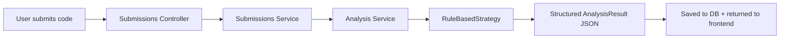

# AI Integration

## AI Ladder Rung: 1 — Single Structured Analysis

This project implements **Rung 1** of the AI capability ladder: a single, synchronous, structured analysis call triggered on every code submission.

## Architecture



## Analysis Strategy Pattern

The system uses a **Strategy Pattern** for analysis:

```typescript
// Interface that all analyzers must implement
export interface AnalysisStrategy {
  analyze(code: string, language: string): AnalysisResult;
}

// Current implementation (rule-based)
class RuleBasedAnalysisStrategy implements AnalysisStrategy { ... }

// Future implementation (LLM-based)
class LLMAnalysisStrategy implements AnalysisStrategy {
  constructor(private apiKey: string) {}
  analyze(code: string, language: string): AnalysisResult {
    // Call OpenAI/Claude API with structured prompt
    // Return AnalysisResult
  }
}
```

### How to Swap to an LLM

```typescript
// In AnalysisService constructor or via config:
if (configService.get('LLM_API_KEY')) {
  this.setStrategy(new LLMAnalysisStrategy(configService.get('LLM_API_KEY')));
}
```

No other code changes needed — the controller, service, and frontend all use the same `AnalysisResult` interface regardless of the analysis backend.

## AnalysisResult Schema

```typescript
interface AnalysisResult {
  linesOfCode: number;       // Non-empty lines count
  functionCount: number;     // Function/method definitions detected
  loopCount: number;         // for/while/do-while loops
  conditionalCount: number;  // if/else-if/switch/ternary
  language: string;          // Programming language detected
  qualityScore: number;      // 1-10, based on code structure heuristics
  suggestions: string[];     // Actionable improvement suggestions
}
```

## Rule-Based Analysis Details

### Scoring Algorithm (1–10)

| Condition | Penalty |
|-----------|---------|
| Lines < 3 | -3 (likely incomplete) |
| Lines > 200 | -2 (too long) |
| Lines > 50, 0 functions | -2 (no functions detected) |
| Conditionals > 10 | -1 (complex control flow) |
| Loops > 5, functions < 2 | -1 (procedural spaghetti) |

Base score is 8. Final score clamped to [1, 10].

### Suggestions Generated

- "Code appears to be very short or incomplete." (< 3 lines)
- "Consider breaking the code into smaller, reusable functions." (> 100 lines)
- "No functions detected. Consider organizing logic into functions."
- "High loop count with few functions. Consider extracting loop logic..."
- "High number of conditionals. Consider using polymorphism or a lookup table."
- "Remove console.log statements in production code."
- "Consider extracting magic numbers into named constants."

## Failure Modes

| Scenario | Behavior |
|----------|----------|
| Empty code string | Analysis runs, gives score 5, suggests code is incomplete |
| Unknown language | Analysis proceeds with language-specific heuristics skipped |
| Very large code (>1000 lines) | Analysis completes in <50ms (no external API calls) |
| Service error | SubmissionService catches, sets status to 'pending', analysis is null |

## Cost & Latency

**Current (rule-based):** ~5ms per analysis, zero cost.

**Estimated with LLM (GPT-4o):** ~1-3 seconds per analysis, ~$0.01 per request.

Planned optimization for LLM: batch analysis, caching identical code submissions, streaming results for immediate partial feedback.

## Future AI Ladder Progression

| Rung | Capability | When |
|------|------------|------|
| 1 | Structured rule-based analysis | ✅ Current |
| 2 | Streaming + LLM structured output | Next — add API key config |
| 3 | Embeddings + pgvector for semantic search | After Neon migration |
| 4 | Full RAG: docs → chunks → embedding → retrieval | Medium-term |
| 5 | Tool-using agent (LLM calls backend APIs) | Longer-term |
