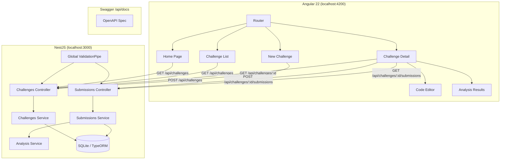

# Architecture

## System Diagram



## Data Flow

1. **Browse Challenges:** User visits `/challenges` → Angular calls `GET /api/challenges` with optional `?difficulty=` and `?category=` filters → NestJS queries TypeORM with `where` clauses → Returns JSON array → Angular renders signal-based card grid.

2. **View Challenge:** User clicks a challenge → Angular calls `GET /api/challenges/:id` → Returns single challenge JSON → Renders detail view with starter code in `<pre><code>` block.

3. **Submit Solution:** User writes code and clicks Submit → Angular calls `POST /api/challenges/:challengeId/submissions` with `{ code, language }` → NestJS saves `Submission` to DB → Calls `AnalysisService.analyze()` synchronously → Stores `resultAnalysis` JSON on the submission → Returns full submission with analysis → Angular displays analysis results in structured cards.

4. **Create Challenge:** User fills form on `/challenges/new` → Angular calls `POST /api/challenges` → NestJS validates with `class-validator` DTO → Saves to DB → Returns created challenge.

## Design Decisions

### Why SQLite with Neon-compatible SQL?
- Local development needs zero configuration (no external database server)
- TypeORM abstraction makes switching to Postgres/Neon a single config change
- Migration SQL is written in standard PostgreSQL-compatible syntax
- See `docs/DATABASE.md` for the Neon migration path

### Why rule-based AI analysis?
- No external API dependencies for the core feature
- The `AnalysisStrategy` interface makes swapping to an LLM trivially easy
- Rule-based analysis gives instant feedback (no network latency)
- LLM integration can be layered on without changing the frontend contract

### Why synchronous analysis on submission?
- Simpler state management (single request/response cycle)
- Analysis completes in <10ms (rule-based), so no need for async processing
- If LLM is added, the endpoint can be changed to return a `202 Accepted` with a polling endpoint

## Request Flow

```
Browser                    NestJS                        SQLite
  │                          │                             │
  ├──GET /api/challenges────>│                             │
  │                          ├──SELECT * FROM challenges──>│
  │                          │<─── rows ──────────────────│
  │<──── JSON array ────────│                             │
  │                          │                             │
  ├──POST /api/challenges/:id/submissions ──>             │
  │                          ├──INSERT INTO submissions──>│
  │                          ├──run AnalysisService()     │
  │                          ├──UPDATE submissions SET    │
  │                          │   result_analysis = ...───>│
  │<── JSON (submission +    │                             │
  │    analysis) ───────────│                             │
```
